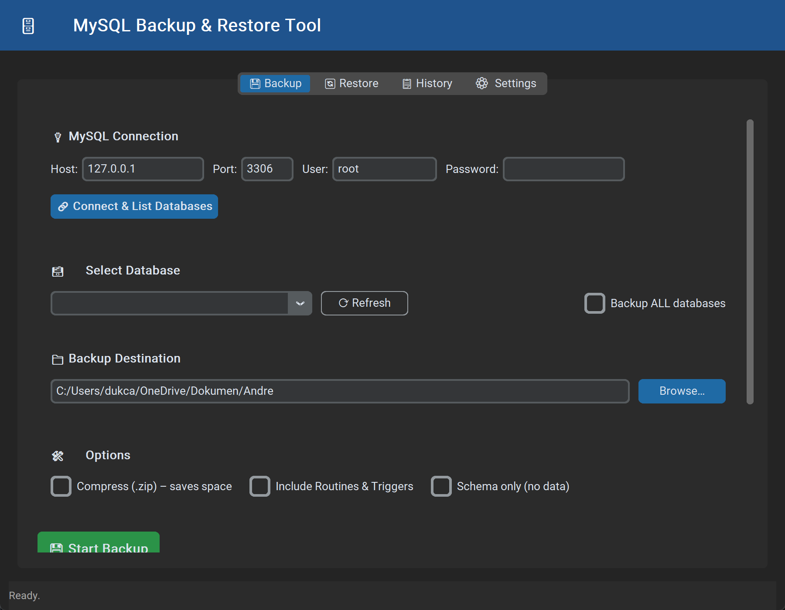

# MySQL Backup & Restore Tool

A standalone PyInstaller executable and Python script to backup and restore MySQL databases using standard `mysqldump` and `mysql` binaries.

This tool was built to solve the issue of migrating databases between devices without requiring Python or the MySQL CLI to be in the system's `PATH`. It dynamically locates local MySQL binaries from common web stacks (XAMPP, Laragon, standalone Server) across all drives.

## Screenshots


## Features
- **Standalone executable**: Compile it once, run it anywhere on Windows without `Python` installed.
- **Dynamic Binary Discovery**: Finds `mysqldump` and `mysql` locally even if they aren't globally registered in the environment variables.
- **Native ZIP Compression**: Option to automatically compress `.sql` dumps to `.zip` to drastically reduce file size.
- **Auto-Extracting Restores**: Directly restores databases from `.zip` files containing `.sql` backups without manual extraction.
- **Connection Persistence**: Saves your database connection strings locally via `mysql_backup_config.json`.
- **Modern UI**: Rewritten using `customtkinter` for a native Dark Mode experience.

## Requirements
To run from source:
```bash
## Python 3.8+ required
pip install customtkinter
```

An existing MySQL server installation (ex. XAMPP, WAMP, Laragon, or raw MySQL Server) is required to execute the underlying `mysqldump`/`mysql` commands.

## Running From Source
```bash
python mysql_backup_restore.py
```

## Compilation (Building the .exe)
If you want to move this tool to a flash drive or another PC that doesn't have Python, recompile the script using PyInstaller.

```bash
pip install pyinstaller
pyinstaller --onefile --windowed --icon=NONE --name="MySQL_Backup_Restore_Tool" mysql_backup_restore.py
```
*(The executable will be generated inside the `dist/` folder)*

## License
MIT
